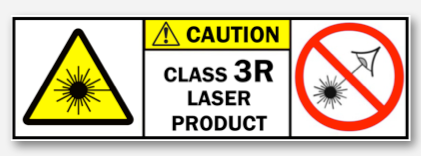

Laser Safety Facts
========================
Class 3R (IIIa) laser safety information

WHAT IS A CLASS 3R LASER?
    **Class 3R lasers are considered safe when handled carefully.** There is only a small hazard potential for accidental exposure. For visible-light lasers, Class 3R lasers' output power is between 1 and 4.99 milliwatts.
    
    In the United States, both Class 2 and 3R lasers can be sold as "pointers" or for pointing purposes. (In Australia, the U.K., and many other countries, laser pointers are restricted to Class 2 only.)
    
    Class 3R is essentially the same as the Roman numeral "Class IIIa" you may see on some lasers' labels. At this website, we primarily use the Arabic numerals, for convenience.

SAFE USE GUIDANCE - GENERAL
    A Class 3R laser is low powered. It normally would not harm eyes during a momentary exposure of less than ¼ second. This is within the aversion response, where a person turns away and/or blinks to avoid bright light.

    **Do not deliberately look or stare into the laser beam.** Laser protective eyewear is normally not necessary. A Class 3R laser is not a skin or materials burn hazard.

    However, a Class 3R laser can be a distraction, glare or flashblindness hazard for pilots and drivers. **NEVER aim any laser towards an aircraft or vehicle that is in motion.** This is unsafe and is illegal -- you could be arrested and jailed.

    **ONLY ALLOW USE BY RESPONSIBLE PERSONS**
    
    **This is not a toy.** Children can safely use Class 3R lasers only with continuous adult supervision.

.. Warning::
    CLASS 3R LASER HAZARDS
        SAFETY NOTICE: This website is intended for the educational, instructional and informational purposes of the user and is not to be considered a substitute for a knowledgeable and trained Laser Safety Officer (LSO) with the duties and responsibilities as defined in the ANSI Z136 standard published by the American National Standard Institute.

        The hazard distances listed below are intended only as general guidance. This is because 1) your laser may vary from the parameters (power, divergence) listed below, and 2) information on labels or marketing materials may not always be correct. For example, studies have shown that some laser pointers may be falsely labeled to avoid regulations -- the actual power may be 10 times or more what the label indicates.

        Always err on the side of safety. If your laser has not been measured by a knowledgeable and trained Laser Safety Officer, assume it is more hazardous than the label or marketing materials would indicate.

EYE INJURY HAZARD
    **EYE INJURY HAZARD -- DIRECT AND REFLECTED BEAM**
    
    Class 3R visible-light lasers are considered safe for unintentional eye exposure, because a person will normally turn away or blink to avoid the bright light. Do NOT deliberately look into or stare into the beam -- this can cause injury to the retina in the back of the eye.    

    Be aware of beam reflections off glass and shiny surfaces. Depending on the surface, the reflected beam could be about as strong and as focused as a direct beam.The Nominal Ocular Hazard Distance (NOHD) for the most powerful Class 3R visible-beam laser (4.99 mW) with a tight beam (0.5 milliradian divergence) is **104 ft (32 m)**.
    
    ..  figure:: images/lasercautions1.png
 
        Color indicates the relative hazard: Red = potential injury, green = unlikely injury. Beyond the Nominal Ocular Hazard Distance, the chance of injury is “vanishingly small” according to safety experts.
     
    For a 4.99 mW Class 3R laser with a less-tight beam that spreads out faster (1 milliradian), the NOHD is 52 feet (16 m). This divergence is more typical of consumer lasers.
    
    .. image:: images/lasercautions2.png

    If you are closer than the NOHD distance to the laser, there is a possibility of retinal damage if the direct or reflected beam enters your eye longer than about ¼ second. The closer you are to the laser and the longer the beam is in the eye, the greater the chance of injury.