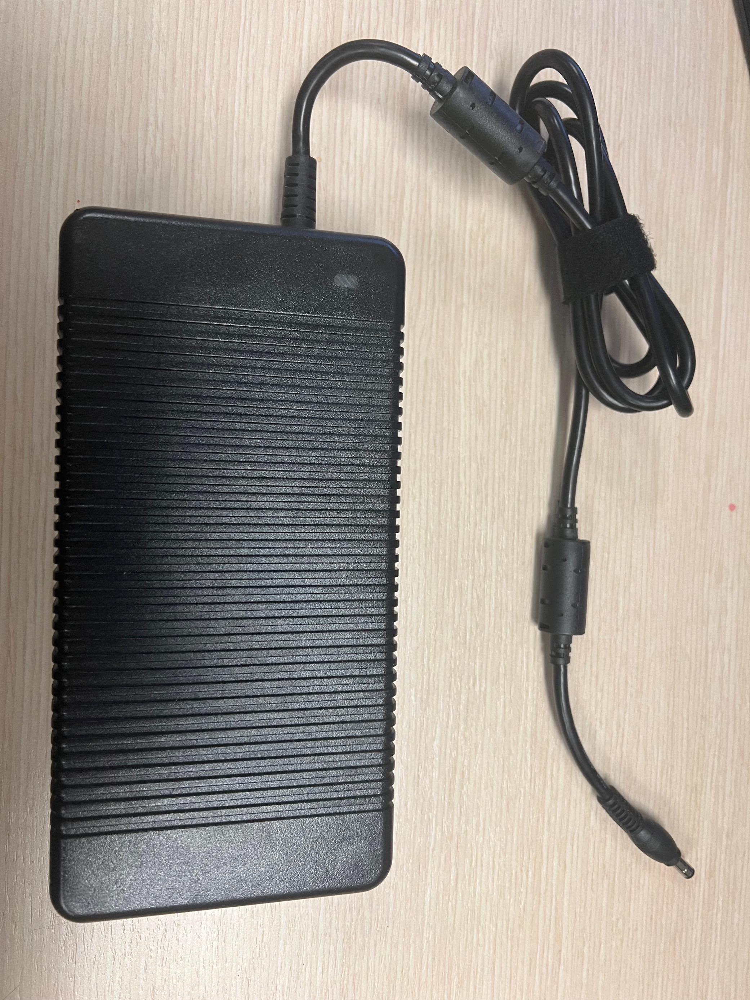
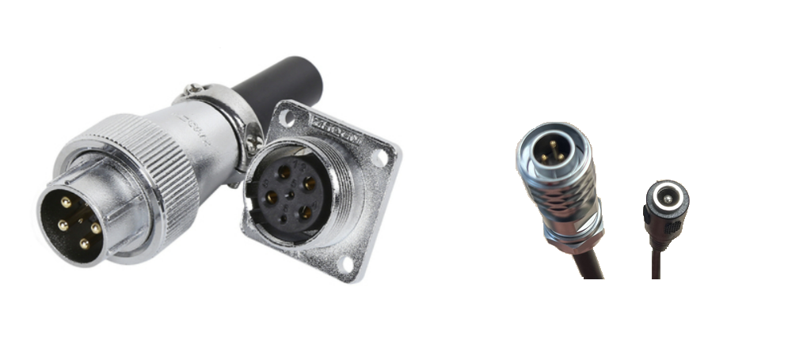

DaoAI Power cable
=====================================

.. contents:: 
    :local:

DaoAI Power Supply
---------------------------------

All DaoAI cameras come with a power supply of 3.2 m in length in total. The DaoAI Power Supply consists of an AC/DC adapter with an integrated DC cable (1.2 m) and a separate AC power cord (2 m). The power cord comes with EU/KOR, US/JAP, CN, or UK AC plug types.

.. tabs::

   .. group-tab:: BP SMALL

    .. list-table:: 

        * - Input voltage
          - 100-240 V AC
        * - Input frequency
          - 50-60 Hz
        * - Output voltage
          - 24 V DC
        * - Output current
          - 10 A 
        * - Line regulation
          - <± 1% of rated input voltage at full load
        * - Rise time
          - ≦50 ms at 100-240 V AC input with full load from 10% to 

            90% of output voltage

        * - Dynamic load 
        
            regulation
          - ±5% excursion for 50%-100% or 100%-50% load change of 
          
            DC output at any frequency up to 1 KHz (duty 50%)
        * - Ripple/noise
          - 1.5 % max of rated output  
        * - Overcurrent
            
            protection
          - 110%-170% of rated output current 

   .. group-tab:: BP MEDIUM

    .. list-table:: 

        * - Input voltage
          - 100-240 V AC
        * - Input frequency
          - 50-60 Hz
        * - Output voltage
          - 24 V DC
        * - Output current
          - 10 A 
        * - Line regulation
          - <± 1% of rated input voltage at full load
        * - Rise time
          - ≦50 ms at 100-240 V AC input with full load from 10% to 

            90% of output voltage

        * - Dynamic load 
        
            regulation
          - ±5% excursion for 50%-100% or 100%-50% load change of 
          
            DC output at any frequency up to 1 KHz (duty 50%)
        * - Ripple/noise
          - 1.5 % max of rated output  
        * - Overcurrent
            
            protection
          - 110%-170% of rated output current 

   .. group-tab:: BP LARGE

    .. list-table:: 

        * - Input voltage
          - 100-240 V AC
        * - Input frequency
          - 50-60 Hz
        * - Output voltage
          - 24 V DC
        * - Output current
          - 15 A 
        * - Line regulation
          - <± 1% of rated input voltage at full load
        * - Rise time
          - ≦50 ms at 100-240 V AC input with full load from 10% to 

            90% of output voltage

        * - Dynamic load 
        
            regulation
          - ±5% excursion for 50%-100% or 100%-50% load change of 
          
            DC output at any frequency up to 1 KHz (duty 50%)
        * - Ripple/noise
          - 1.5 % max of rated output  
        * - Overcurrent
            
            protection
          - 110%-170% of rated output current 

   .. group-tab:: BP AMR

    .. list-table:: 

        * - Input voltage
          - 100-240 V AC
        * - Input frequency
          - 50-60 Hz
        * - Output voltage
          - 24 V DC
        * - Output current
          - 10 A 
        * - Line regulation
          - <± 1% of rated input voltage at full load
        * - Rise time
          - ≦50 ms at 100-240 V AC input with full load from 10% to 

            90% of output voltage

        * - Dynamic load 
        
            regulation
          - ±5% excursion for 50%-100% or 100%-50% load change of 
          
            DC output at any frequency up to 1 KHz (duty 50%)
        * - Ripple/noise
          - 1.5 % max of rated output  
        * - Overcurrent
            
            protection
          - 110%-170% of rated output current 

    
   .. group-tab:: BP AMR-GPU

    .. list-table:: 

        * - Input voltage
          - 100-240 V AC
        * - Input frequency
          - 50-60 Hz
        * - Output voltage
          - 24 V DC
        * - Output current
          - 10 A 
        * - Line regulation
          - <± 1% of rated input voltage at full load
        * - Rise time
          - ≦50 ms at 100-240 V AC input with full load from 10% to 

            90% of output voltage

        * - Dynamic load 
        
            regulation
          - ±5% excursion for 50%-100% or 100%-50% load change of 
          
            DC output at any frequency up to 1 KHz (duty 50%)
        * - Ripple/noise
          - 1.5 % max of rated output  
        * - Overcurrent
            
            protection
          - 110%-170% of rated output current 

DaoAI Power Extension Cables
--------------------------------

We also offer power extension cables in 5 m, 10 m, and 20 m options. 

DaoAI strongly recommends that the cables are carefully checked before use or if run time errors occur. 
The Power connector needs to be screwed in completely to ensure the watertight IP rating of the camera.

.. note::
    When using DC power extension cables For DaoAI cameras, ensure both the PC and the camera AC/DC adapter are supplied from the same power outlet.

.. tip::
    DaoAI Power Extension Cables are specifically designed high-quality cables suitable for robot applications.

.. .. tabs::

..    .. group-tab:: BP SMALL

..     +-----------------------+--------+------------------------------+
..     | Pinout                |  Pin   |  Purpose                     | 
..     +=======================+========+==============================+
..     |                       |   1    |  DC24V                       |
..     |                       +--------+------------------------------+
..     |.. image:: images/1.png|   2    |  RGND                        | 
..     |  :align: center       +--------+------------------------------+
..     |                       |   3    |  TRGE                        | 
..     |                       +--------+------------------------------+
..     |                       |   4    |  TGND                        | 
..     |                       +--------+------------------------------+
..     |                       |   5    |  SGND                        | 
..     |                       +--------+------------------------------+
..     |                       |   6    |  Reserved, do not connect    | 
..     +-----------------------+--------+------------------------------+

..     .. tip::
..         - PGND: represent the "power ground"
..         - AGND: represent the "analog ground"
..         - DGND: represent the "digital ground"
..         - SGND: represent the "signal ground"

..    .. group-tab:: BP MEDIUM

..     +-----------------------+--------+------------------------------+
..     | Pinout                |  Pin   |  Purpose                     | 
..     +=======================+========+==============================+
..     |                       |   1    |  DC24V                       |
..     |                       +--------+------------------------------+
..     |.. image:: images/1.png|   2    |  RGND                        | 
..     |  :align: center       +--------+------------------------------+
..     |                       |   3    |  TRGE                        | 
..     |                       +--------+------------------------------+
..     |                       |   4    |  TGND                        | 
..     |                       +--------+------------------------------+
..     |                       |   5    |  SGND                        | 
..     |                       +--------+------------------------------+
..     |                       |   6    |  Reserved, do not connect    | 
..     +-----------------------+--------+------------------------------+

..     .. tip::
..         - PGND: represent the "power ground"
..         - AGND: represent the "analog ground"
..         - DGND: represent the "digital ground"
..         - SGND: represent the "signal ground"

..    .. group-tab:: BP LARGE

..     +-----------------------+--------+------------------------------+
..     | Pinout                |  Pin   |  Purpose                     | 
..     +=======================+========+==============================+
..     |                       |   1    |  DC24V                       |
..     |                       +--------+------------------------------+
..     |.. image:: images/1.png|   2    |  RGND                        | 
..     |  :align: center       +--------+------------------------------+
..     |                       |   3    |  TRGE                        | 
..     |                       +--------+------------------------------+
..     |                       |   4    |  TGND                        | 
..     |                       +--------+------------------------------+
..     |                       |   5    |  SGND                        | 
..     |                       +--------+------------------------------+
..     |                       |   6    |  Reserved, do not connect    | 
..     +-----------------------+--------+------------------------------+

..     .. tip::
..         - PGND: represent the "power ground"
..         - AGND: represent the "analog ground"
..         - DGND: represent the "digital ground"
..         - SGND: represent the "signal ground"

..    .. group-tab:: BP AMR

..     +-----------------------+--------+------------------------------+
..     | Pinout                |  Pin   |  Purpose                     | 
..     +=======================+========+==============================+
..     |                       |   1    |  DC24V                       |
..     |                       +--------+------------------------------+
..     |.. image:: images/2.png|   2    |  RGND                        | 
..     |  :align: center       +--------+------------------------------+
..     |                       |   3    |  SGND                        | 
..     +-----------------------+--------+------------------------------+

..     .. tip::
..         - PGND: represent the "power ground"
..         - AGND: represent the "analog ground"
..         - DGND: represent the "digital ground"
..         - SGND: represent the "signal ground"

   
..    .. group-tab:: BP AMR-GPU

..     +-----------------------+--------+------------------------------+
..     | Pinout                |  Pin   |  Purpose                     | 
..     +=======================+========+==============================+
..     |                       |   1    |  DC24V                       |
..     |                       +--------+------------------------------+
..     |.. image:: images/2.png|   2    |  RGND                        | 
..     |  :align: center       +--------+------------------------------+
..     |                       |   3    |  SGND                        | 
..     +-----------------------+--------+------------------------------+

..     .. tip::
..         - PGND: represent the "power ground"
..         - AGND: represent the "analog ground"
..         - DGND: represent the "digital ground"
..         - SGND: represent the "signal ground"

