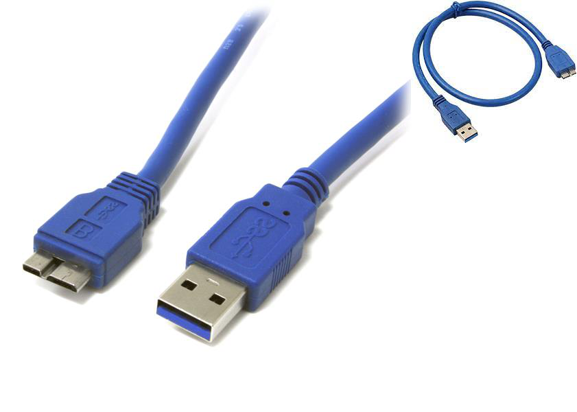

Usb cable
================================

All the cables DaoAI supplies are designed for machine vision and robotics applications and tested for twisting, bending, and pull force. We can provide mechanical reliability test reports for all our cables on request.

We offer the following two data cable options:

- 5 m USB 3.0 type A to Micro B copper cable

Double-shielded, twisted-pair data wiring minimizes cross talk for error   free SuperSpeed data transfer rates

Support data transfer rates up to 4.8Gbps

Backwards compatible with computer USB 2.0 and USB 1.1 ports - these cables   also allow connection of USB 3.0 devices to legacy USB 2.0 computers

.. note::
    Use only DaoAI approved copper cables and active optical extenders. Ensure that all connections are screwed in tightly. Using a direct cable from the PC to the DaoAI camera works better than connecting the camera via a USB hub.

Longer USB copper cables are known to be susceptible to data transfer errors if poorly connected. For this reason, DaoAI strongly recommends that the cables are carefully checked before use or if run time errors occur. It is also strongly recommended to tighten the M2 Jack screws on the camera side with a screwdriver when setting up the camera. The USB connector needs to be screwed in completely to ensure the watertight IP rating of the camera.

.. warning::
    Use the DaoAI Active Optical USB 3.0 Cable extenders only together with the provided short blue cable, displayed in the image above. Do not use DaoAI optical extenders with any other cables, including standard DaoAI 5 m copper cables.
    
    Do not install DaoAI optical cables (specifically the bulky grey connector) in a cable enclosure or a sleeve. This may cause overheating and thus connection issues.