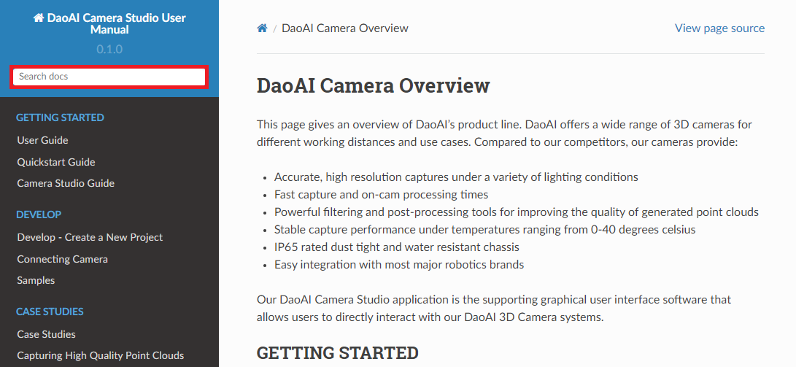

Bug Report
============

If your issue is not addressed in the user manual nor listed on our FAQ page, you can report your issue at our `Help Center <https://daoai.atlassian.net/servicedesk/customer/portals>`_. 

You can also reach out to us via support@daoai.com and our team will get back to you as soon as possible!

Search for Related Articles
-------------------------------------

You can type in the keyword in the search bar located in the upper left side to look for related articles on your topic. 

.. image:: images/user_manual_search_result.png

For example, we searched for the keyword "point cloud", and all articles related to point clouds are listed in the result.

|

Search for Related Bug Reports
-------------------------------------

.. image:: images/help_center_search_bar.png

You can search for the keyword

.. image:: images/help_center_see_all_request.png

|

Report a Bug
--------------

To report a bug, please go the `Help Center <https://daoai.atlassian.net/servicedesk/customer/portals>`_ and click "Report a Bug".

.. image:: images/help_center_home_report_a_bug.png

Please fill in as much information as possible (e.g. software version) so that we can resolve the problem as quickly as possible.

.. image:: images/help_center_report_bug_page.png

To check your software version: 
Locate the top menu bar --> select "Help" --> select "About DaoAI Studio".

.. image:: images/help_center_check_version.png

You can find the software version under the DaoAI Studio logo. In this case, the software version is 2.22.10.0_103.

.. image:: images/help_center_check_version_window.png

If you encountered a crash, you can find the dmp file via the path C:\ProgramData\DaoAI\Camera Studio\Crashpad\db\reports.

Here are some other information that would be nice to have:

    - Steps to reproduce the issue
    - Software version, working environment
    - Your name
    - Contact email address and phone number (so that we can update you on the feature)

|