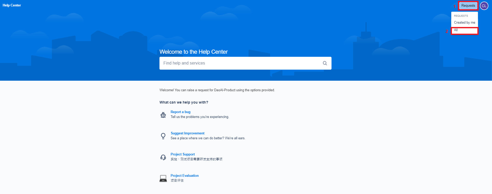

Suggest a Feature
==================

If you would like to see a new feature added in DaoAI Camera Studio, you suggest it at our `Help Center <https://daoai.atlassian.net/servicedesk/customer/portals>`_. 

Search for Related Suggestions
-------------------------------

Before you submit your feature suggestion, please check if any other similar feature request has already been submitted.
You can see all feature suggestions by clicking "Requests" --> All at the top right corner.

.. image:: images/help_center_requests_list.png

You can adjust the filters to search for specific requests.

Feature Request
----------------

Go to the `Help Center <https://daoai.atlassian.net/servicedesk/customer/portals>`_ home page. 

Select the second option, "Suggest Improvement".

.. image:: images/help_center_suggest_improvement.png

You will be directed to the Suggest Feature page.

.. image:: images/help_center_feature_page.png

Here are some information that would be nice to have:

    - Feature description
    - why would the feature be a great addition
    - Your name
    - Contact email address and phone number (so that we can update you on the feature)

Please fill in as much detail as you can regarding your suggestions, so that we can realize your requests as soon as possible!

|