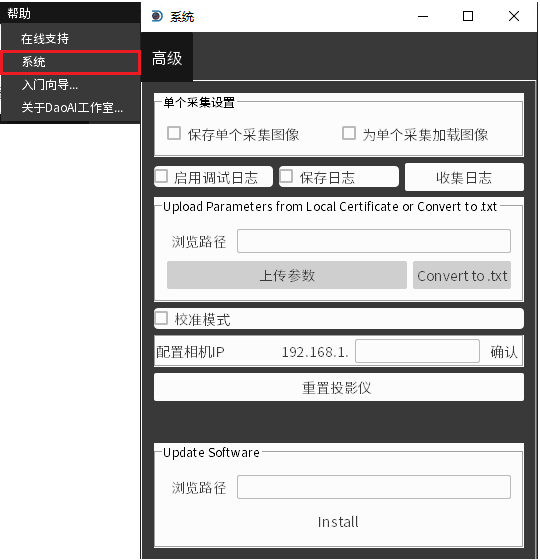
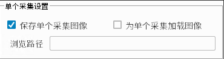
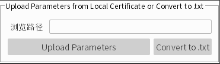
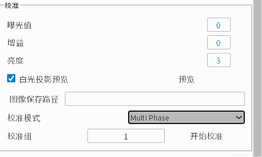
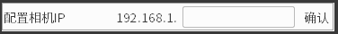
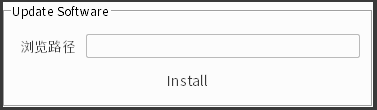

.. 中文only

内部调试功能
=================

此界面需要密码访问, 可提供高级系统设置。

|

- **保存采集原始图片**:
   保存采集过程中的所有原始光栅图片到选择的路径下。

|

- **启用调试日志**:
   会在控制台中显示更详细的调试信息。
   

|

- **保存日志**:
   保存调试信息为Log文件。

|

.. warning::
   Log文件会在软件开启时持续访问, 并在关闭软件时才能完全写入。
   请不要在写入Log时启用控制台信息过滤。只有显示在控制台的内容会被写进log.

.. tip::
   Log文件的保存路径在 "C:\用户\<用户名>>\AppData\Local\DaoAI\Camera Studio\logs\" 目录下

- **收集日志**:
   仅对网口相机有效。获取树莓派和Jetson Log文件, 同样存放在小贴士中提到的路径下。 

|

- **上传参数**:
   仅对网口相机有效。上传certificate bin文件。

|

- **校准模式**:
   启用相机校准模式, 启用后会在主界面中显示校准界面。详细请参考 :ref:`校准模式` 章节

|

- **配置相机IP**:
   仅对网口相机有效。 修改网口相机的默认IP。

|

- **重置投影仪**:
   手动触发软重启4710光机。

|

- **升级软件**:
   仅对网口相机有效，选择一个树莓派/jetson程序的安装包zip文件，点击install，可以自动安装更新。

   
|

